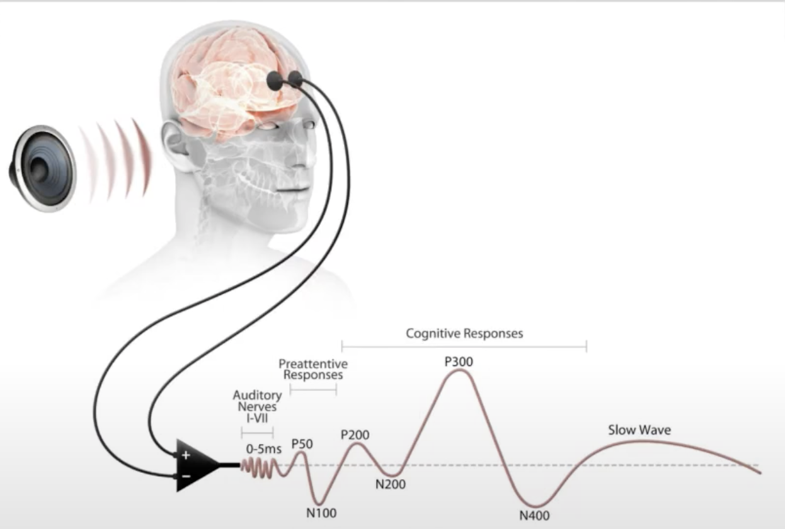
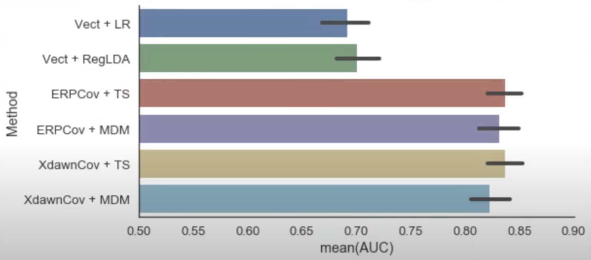
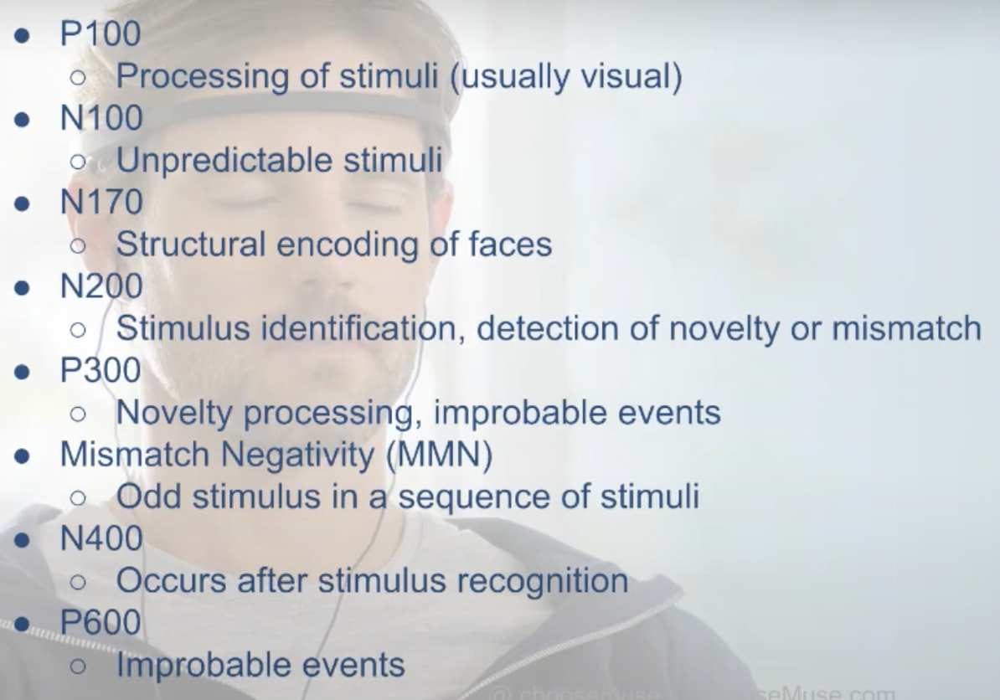
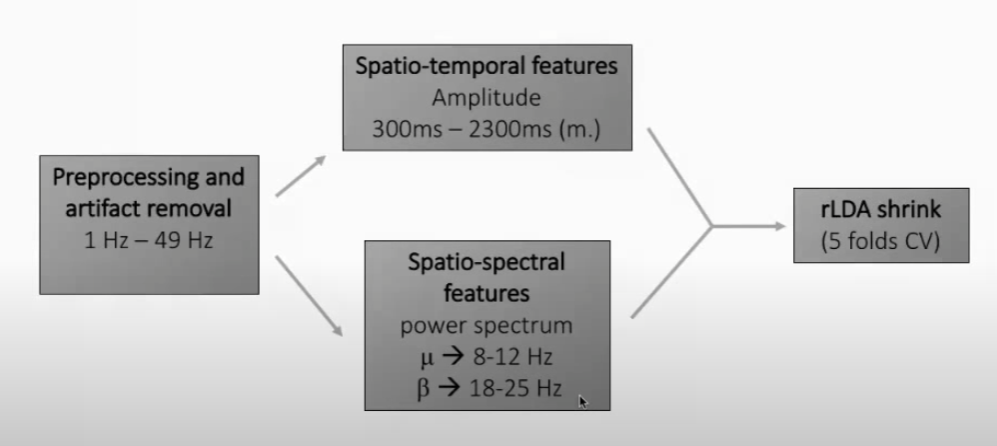

# NeuroTechX Webinars (1-9)

According to [NeuroTechX's website](https://neurotechx.com/), NeuroTechX (NTX) is a non-profit organization whose mission is to facilitate the advancement of neurotechnology by providing key resources and learning opportunities, and by being leaders in local and worldwide technological initiatives. On their [YouTube channel](https://www.youtube.com/c/NeuroTechX) many BCI related videos are available. This document gives some notes that were taken whilst watching their webinars from 2018 to 2019, webinars 1 to 9. This playlist is available [here](https://www.youtube.com/watch?v=AFKNbNBCtXs&list=PL7yYIG1eq9bTbK-W66TCl7t8wTXwelSNz). The notebooks from the video are available [here](https://github.com/NeuroTechX/eeg-notebooks).

## Table of contents

- [Contact information](#contact-information)
- [NeuroTechX Webinar #1: EEG Notebooks](#neurotechx-webinar-1-eeg-notebooks)
- [NeuroTechX Webinar #2: BCI and EEG in VR and AR](#neurotechx-webinar-2-bci-and-eeg-in-vr-and-ar)
- [NeuroTechX Webinar #3: BCI UX - User Focused Paradigms for Enhancing BCIs](#neurotechx-webinar-3-bci-ux---user-focused-paradigms-for-enhancing-bcis)
- [NeuroTechX Webinar #4: NeuroEthics with the International NeuroEthics Society](#neurotechx-webinar-4-neuroethics-with-the-international-neuroEthics-society)

## Contact information

| Name             | Role                 | VUB mail                                                  | Personal mail                                               |
| ---------------- | -------------------- | --------------------------------------------------------- | ----------------------------------------------------------- |
| Lennert Bontinck | Master Thesis writer | [lennert.bontinck@vub.be](mailto:lennert.bontinck@vub.be) | [info@lennertbontinck.com](mailto:info@lennertbontinck.com) |

## NeuroTechX Webinar #1: EEG Notebooks

This webinar is available [here](https://youtu.be/AFKNbNBCtXs). The host of the webinar was Sydney Swaine-Simon. The speaker discussing the notebook was Dano Morrison.

- Dano Morrison spoke about the Jupyter Notebooks made by NTX. These notebooks aim to make working with EEG for the first time more accessible.
- They used Muse LSL to connect devices which makes use of pygatt, pylsl and BlueMuse (thus based on **Lab Streaming Layer**)
- Stimulus presentation happens through **PsychoPy**
- Data analysis happens through **MNE**
- Data visualization happens through **MatPlotLib**
- He went through the N170 notebook
   - The N170 is a large negative event-related potential (ERP) component that occurs after the detection of faces, but not objects, scrambled faces, or other body parts such as hands.
- They used a **MUSE headband** (MUSE 2016)
   - This is one of the early commercial BCIs with somewhat widespread adoption. Used for focus etc.
- 2-minute trials are often a good idea because they will lead to fewer errors and noise since the user will have the ability to focus for the whole length
- They experimented with the notebook where you watch flashing images, some of houses others of faces. The faces should trigger the N170. This can be used for "live" classification accuracy testing as well.
   - He said this is *not so fun* but it is needed around 3 - 6 times for 2 minutes each. This is an issue with data collection for BCI applications.
- Again, peaks at some random frequencies (Hz's) - e.g. **60hz peak for electrical wires**.
- Often a "low level pass" -> **filter out lower frequencies, e.g. 0 - 30**. All of this is easy with MNE.
- **Epoching of data** -> split continues data in smaller data frames. Here for reaction to faces or other objects +- 100ms before and 800ms after the stimulus.
   - So your data should be labelled what is seen/done when. Otherwise, it is just random data.
- Was shown how deflection (negative impulse) is visible in face recognition. Thus experiment was successful. 
- Uses **SciKit pipelines** and classifiers to test different performance aspects.

## NeuroTechX Webinar #2: BCI and EEG in VR and AR

This webinar is available [here](https://youtu.be/Rggx_YVc6CM). The host of the webinar was Yannick Roy and Micah Blumberg. 

- Repeated that NeuroTechX is some sort of international community that organizes differing things surrounding neurotechnology. It grew from people in the BCI field that didn't have places to formally discuss other than highly academic channels. It's somewhat in between the academic and hobby scene.
- One of the guests was from **Interaxon**. Both Graeme Moffat, chief scientist & VP Regulatory as well as Ben Shapiro, EEG Scientist were present. Interaxon is best known for the **Muse headband**. But they also have different **commercial EEG products**.
  - Their origins are from wanting to use **EEG in VR/AR**.
  - However, quickly became obvious how hard it is.
- **Muse headband backstory**
  - Whilst trying to go from *focus* to * non-focus* the founder noticed this was a practice also done as mental meditation exercises. This somewhat leads to the **founding of the Muse headband**.
  - Muse has gamified this EEG data processing to make people e.g. more aware of focus or not focused state of mind etc.
- They noticed that for fine control in AR/VR the low-cost dry systems were not good enough. **Medical grade high-density systems were needed**. However, progress in making better low-cost dry systems available out of the lab is getting further and further.
  - Thus, **commercialising EEG** so that it becomes more affordable.
- Talked about **event-related response**, e.g. from flashing something. This response tells a lot more than just that it is being noticed. E.g. lower curves might mean a **more tired brain**. 
- Many of the signals are called **PXXX** or **NXXX** such as **P300**. This stands for either positive or negative electrical current with the number presenting *how much time has passed* since the stimulus.
  - E.g. N170 from the previous seminar is 170ms after stimulus
  - 
- Many labs **compare the Muse to ActiCap and other systems**. E.g. Krigoison et al 2017. Results say Muse is an okay performance at a much lower cost and better portability.
- **VR is in healthcare**, it has many positive effects already. People in the field are Brennan Spiegel, Skip Rizzo and Walter Greenleaf.
- The **age of patients** seem to play a role in the **Alpha peak frequency (AF7)** as was demonstrated by McMaster University. Thus **EEG** can be used for *brain health purposes*.
- **Training ERPs is fast**, in many cases, not more than 20 trials suffice to classify data in a trustworthy manner as found by Muse technology (Interaxon).
- Some of the **classification methods** often tested with
  - 
- **ERP components**
  - 
- The goal of Muse is to make **affordable yet usable EEG devices** so that it becomes available for the masses, both for recreational as well as professional/medical use.
- The talk then switched to Neurable, **Neurable is a software company focused on processing neurological data**.
- Neurable is convinced hardware and machines are going to evolve even further becoming even more complex. Because of this the typical mouse and keyboard interaction simply won't be enough to control this hardware. BCI aims to offer a faster, better interface, such as **Neuralink** also aims to offer.
- Neurable focuses on delivering software to interpret and use EEG and ERP signals. Most of their focus seems to be on AR/VR applications and often games. They have EEG sensors connected to the **HTC Vive** headset. They often use P300. They create **live online classification** technology.
- Problem is that **current research** uses 256 gell cap which is **not portable**. Muse and others provide headsets with only 6 dry electrodes for more commercial use. There is a push to limit this even further with **EEG glasses** (Interaxon) or **Dry headphone EEG** (Japanese lab) and other *less obvious standalone* BCI hardware.
- **Neurable** is vague on *how they do it*, with the spokesman stating *how we do it is our secret sauce*. This is not ideal as *open source projects* are more helpful for the field.
- One of the challenges for **few electrode BCIs** is the location of the electrodes. Some focus on the motor cortex, others the visual, ...
- **OpenVibe** is a great starting platform.
- Neurable discussed that **deep learning has not demonstrated a major boost in performance**. He thus suggests that most of the performance lays in feature selection etc. He thinks deep learning has possibilities in limiting calibration etc. Indeed, calibration is an **issue with removable headsets**. The user puts the headset on slightly differently each time.
- To discuss **issue of putting the headset on differently**, the answers are:
  - Some signals are more or less sensitive to placement. ERPs are especially *lax* in this aspect. Thus same placement is not completely needed as change is still measurable. Training needs however to take into account these variations in location.
  - Often the variation from session to session is not that big either as there is only *one way* to comfortably put on most headsets and it wouldn't differ much between sessions *for the same person*. Different persons will have different preferences and thus often retraining will be needed per person for this reason but also likely only once.
  - Electrode positioning is often not an issue according to Neurable if the headset has been designed smartly.  

## NeuroTechX Webinar #3: BCI UX - User Focused Paradigms for Enhancing BCIs

This webinar is available [here](https://youtu.be/92Fn9jBJXBA). The webinar was hosted by Sydney Swaine-Simon. The guest speaker was Irina Emilia Nicolae. Phd in the field of signal processing and Brain-Computer Interfaces (BCI). Her research focuses on cognitive processes and motor imagery, targeting user focused paradigms and user state monitoring.

- She mentioned that previous tests focused on getting best classification results not on best user experience. She was against strict tedious tasks.
   - Causes more efficient interaction.
- Tried to make an experiment that was most enjoyable for the user yet still useable (classification) results.
- 3 motor imaginary investigated
   - Button press
   - Arm lifting
   - Trigger pull (e.g. for gaming)
- experiment setup
   - 2 seconds 'relaxation'
   - 0.5 seconds 'preparing for signal'
   - 3 seconds performing test
      - Triggered by differing stimuli: visual, voice, combined
      - Was done for P300
- Used BIOPAC for EEG and EMG
   - EEG: C3, C4 (2/32 IS 10-20)
- Steps taken for analysis 
   - 
- They then made a **temporal and spectral plot** of all channels over time. The differing stimuli where noticed. **Strength of arm lifting signal differed for left/right handed people**!
- User found performing these understandable but not too common interactions most enjoyable. It was easy to do but not *too boring*.
- some of the challanges to go online (real time) given where
   - Portable hardware: dry/water-based electrodes
   - Continues paradigms
   - Out of lab scenario (more noise)

### Related documents

- Publications on efficient motor imagery tasks
   - DOI: [10.1109/EMBC.2016.7592061](https://doi.org/10.1109/EMBC.2016.7592061)
   - DOI: [10.1109/ECAI.2014.7090216](https://doi.org/10.1109/ECAI.2014.7090216)
- Publications on cognitive processing levels
   - https://doi.org/10.3389/fnins.2017.00548
   - DOI: [10.3217/978-3-85125-467-9-186](https://openlib.tugraz.at/download.php?id=5e6a26bb560da&location=medra)
- Dataset
   - http://dx.doi.org/10.14279/depositonce-6173

## NeuroTechX Webinar #4: NeuroEthics with the International NeuroEthics Society

This webinar is available [here](https://youtu.be/GlJk871GyTQ).

* * *
* * *
© [Lennert Bontinck](https://www.lennertbontinck.com/) VUB 2021-2022